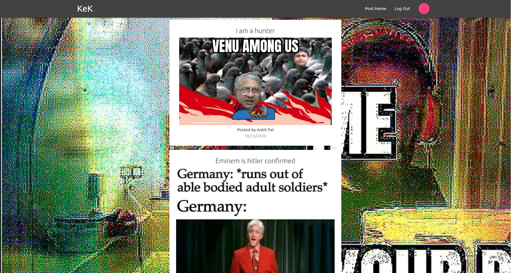

# Post-And-View-Memes

## check out it out on this link to add your memes in too

https://just-meme-eet.netlify.app/

This is a web app that let's you post memes and view them

# Sign-in Page

# Login Page

# Dashboard

# Post Details

## FrontEnd

* React (using Create React App)
* Materialize CSS classes
* Redux (for state management)
* It's optimised for both desktop and mobile viewing

# The FrontEnd code is organised as: 
 
* componenets (holds the jsx for different routes)
* config (firebase config file)
* styles (contains css files for the component files)

## BackEnd

* serverless (used Firebase)
    * set up auth
    * used firestore to store post and user data
    * Firebase Storage for storing images

### Setting up dev environment

* make sure to have node --version 10 or above
* git clone https://github.com/ankitpal1029/Post-And-View-Memes.git
* cd Post-And-View-Memes
* npm install
* npm start

